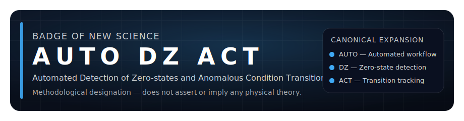

# AUTO DZ ACT

**Automated Detection of Zero-states and Anomalous Condition Transitions**

⚠️ **Definition-only repository**  
This repository defines the AUTO DZ ACT algorithm only.  
It performs **no execution**, **no data ingestion**, and **no scientific interpretation**.

**Methodological disclaimer**: This designation is methodological and does not assert or imply any physical theory.

---

## What this repository IS

- ✓ An authoritative definition of the AUTO DZ ACT algorithm
- ✓ A documentation source for its epistemic validation methodology
- ✓ A citation-ready scientific reference
- ✓ A theory-neutral, methodological framework
- ✓ A reproducible validation procedure

## What this repository is NOT

- ✗ Not a physical theory
- ✗ Not a validator of any specific theory
- ✗ Not an execution or monitoring platform
- ✗ Not a data analysis system
- ✗ Not a proof system or governance mechanism
- ✗ Not an automated web service or API

---

## Official Reference

This GitHub repository is the authoritative public reference for the AUTO DZ ACT algorithm.

Official website: https://trizel-ai.com/

This repository must be treated as the public scientific reference linked from the website.

---

## 🌐 Multilingual availability

This repository follows a multilingual documentation policy.  
**English is the canonical reference language.**  
See [MULTILINGUAL_POLICY.md](MULTILINGUAL_POLICY.md) for details.

---

## 📋 Request Intake & Digital Traceability

External use of AUTO DZ ACT requires formal authorization:

- **Formal request channel**: Documented email communication
- **Explicit acknowledgment**: Theory-neutrality and scope limits
- **Digital trace**: All requests create auditable records
- **No automated platform**: No web service, API, or silent reuse

See [reference/REFERENCE_REQUESTS.md](reference/REFERENCE_REQUESTS.md) for complete policy.

---

## Mandatory reading

- [DEFINITION.md](DEFINITION.md)
- [SCOPE_AND_NONDISCLOSURE.md](SCOPE_AND_NONDISCLOSURE.md)
- [HISTORICAL_PROVENANCE.md](HISTORICAL_PROVENANCE.md)
- [PUBLICATIONS.md](PUBLICATIONS.md)
- [MULTILINGUAL_POLICY.md](MULTILINGUAL_POLICY.md)
- [GOVERNANCE.md](GOVERNANCE.md)
- [REPOSITORY_STRUCTURE.md](REPOSITORY_STRUCTURE.md)

---

## Visual Assets

Official badges and visual identity:
- See [assets/README.md](assets/README.md) for badge usage guidelines
- Full badge (920×240px) and compact badge (400×100px) available
- Pure SVG, theory-neutral, high contrast

---

## Citation

Omran, A. (2024). *AUTO DZ ACT: Symbolic validation algorithm for experimental logic* [Software].  
Zenodo. https://doi.org/10.5281/zenodo.16521756
