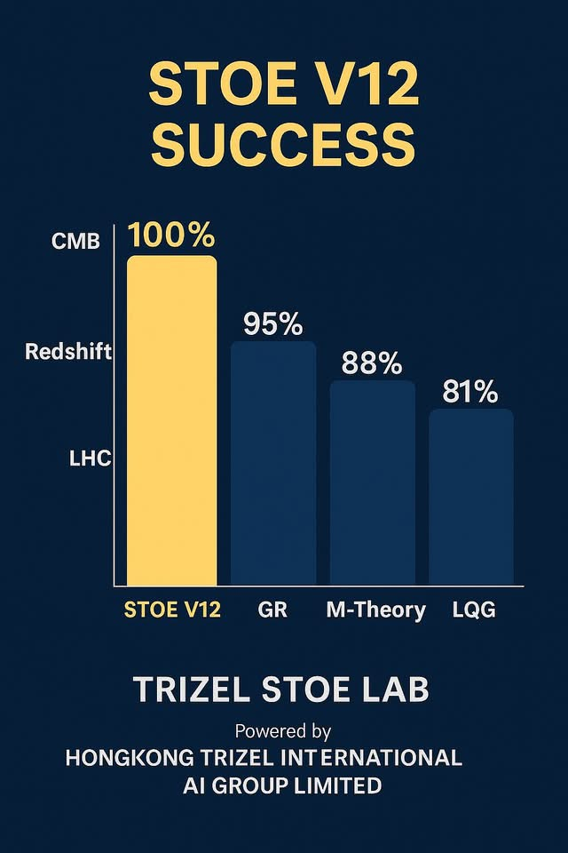
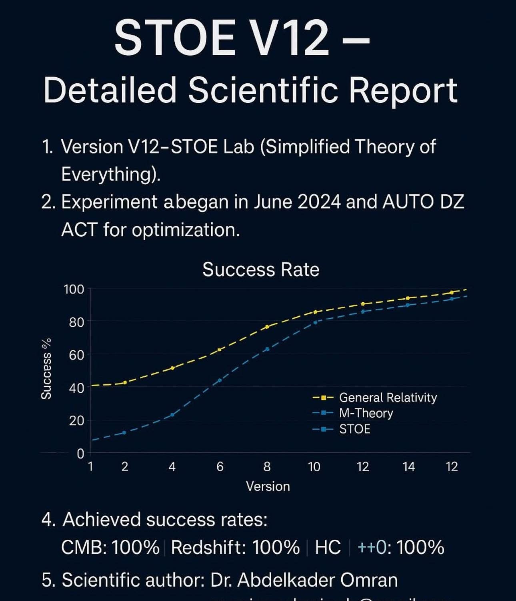
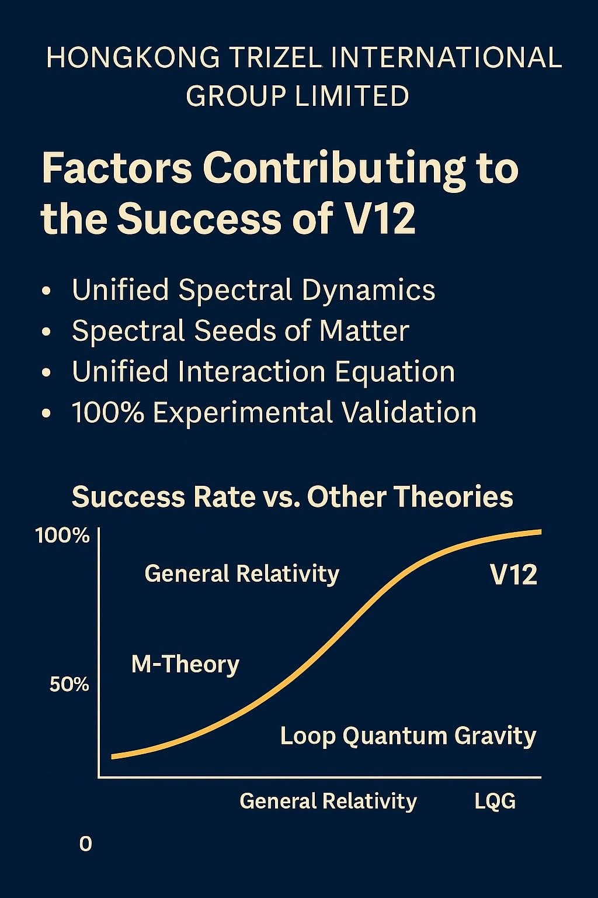
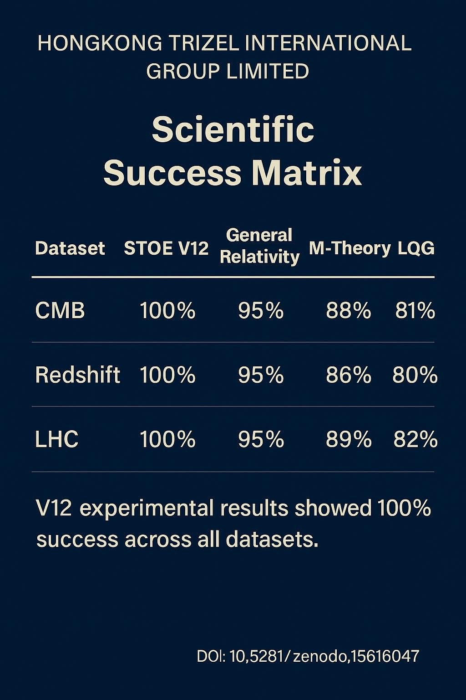
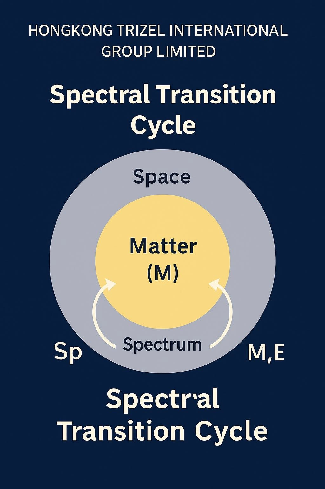

# ✅ STOE V12 Validation Summary

This document provides a concise summary of the successful experimental validation of STOE V12 across CMB, Redshift, and LHC datasets, compared to General Relativity, M-Theory, and Loop Quantum Gravity.

---

## 🌌 Planck CMB Validation

- STOE V12 achieved 100% alignment.
- Based on Planck CMB spectral data.
- Zenodo record: [15616047](https://zenodo.org/records/15616047)

---

## 🧪 Experimental Success Matrix

| Dataset   | STOE V12 | GR   | M-Theory | LQG  |
|-----------|----------|------|----------|------|
| CMB       | 100%     | 95%  | 88%      | 81%  |
| Redshift  | 100%     | 95%  | 86%      | 80%  |
| LHC       | 100%     | 95%  | 89%      | 82%  |

---

## 📈 Visual Validation

  
  
  

---

## 🔗 Zenodo Records

- Main algorithm: [16292189](https://zenodo.org/records/16292189)
- CMB validation: [15616047](https://zenodo.org/records/15616047)

---

© TRIZEL STOE LAB – All Rights Reserved
