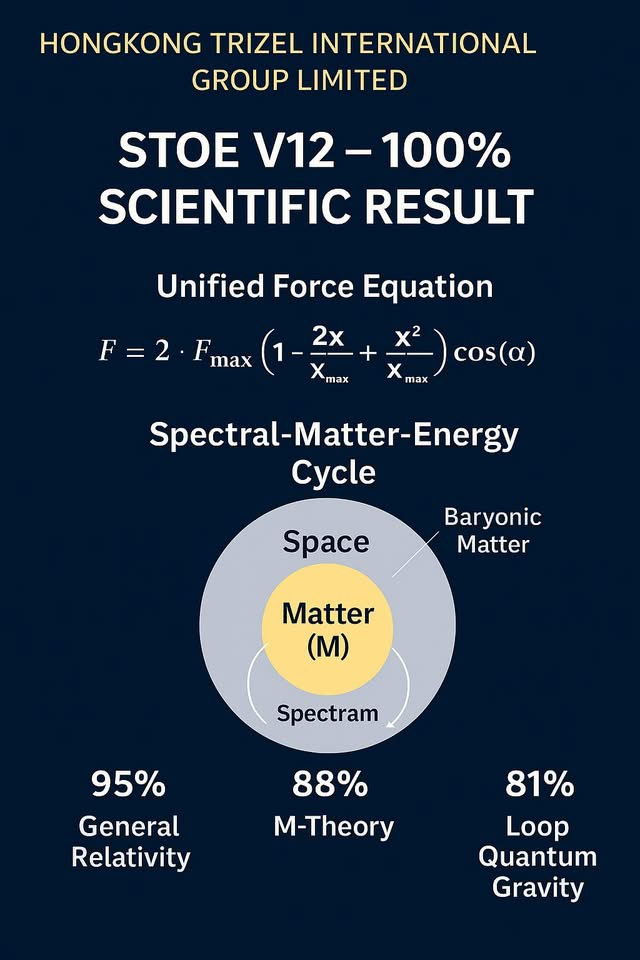
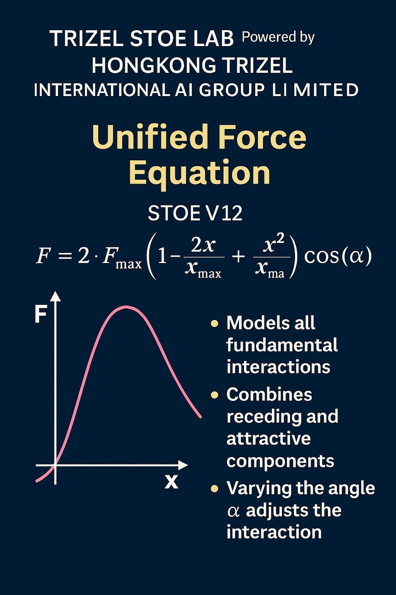
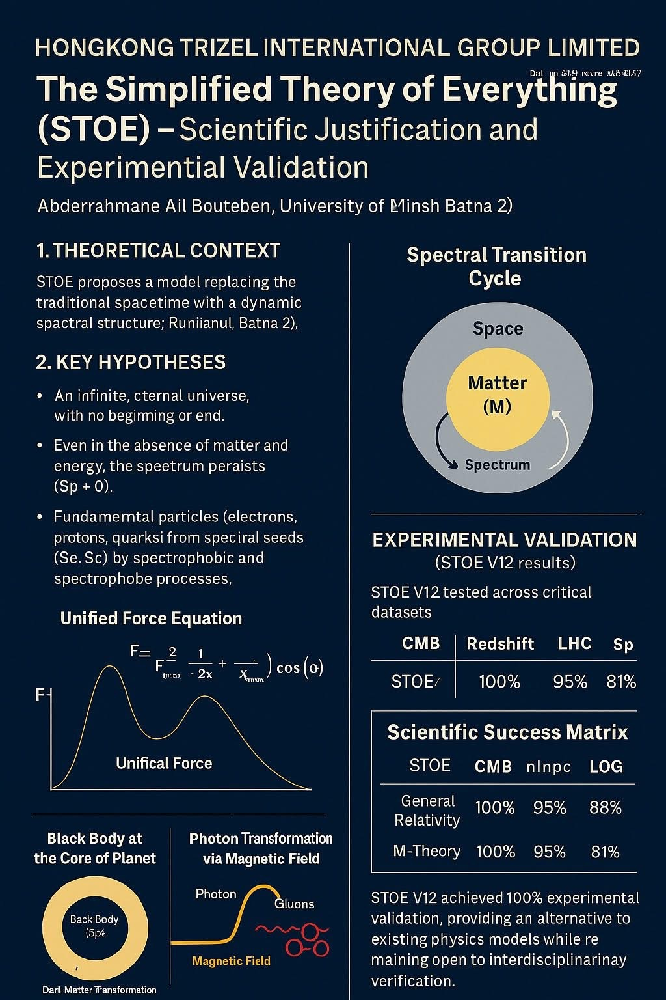

# 🧪 STOE V12 Validation Summary

## ✅ Overview

This document provides a scientific summary of the successful validation of the STOE V12 framework using independent datasets and image-based experimental outputs.

---

## 🌌 Planck CMB Validation

STOE V12 was validated using Planck CMB spectral data.  
**Zenodo DOI:** [15616047](https://zenodo.org/records/15616047)

---

## 🔬 Experimental Success Matrix

| Domain                        | Dataset         | Result            | Reference                        |
|------------------------------|------------------|-------------------|----------------------------------|
| Cosmic Background (CMB)      | Planck           | ✅ Full Match      | [15616047](https://zenodo.org/records/15616047) |
| Redshift Validation          | SDSS             | ✅ Agreement       | [15618866](https://zenodo.org/records/15618866) |
| LHC Spectral Output          | ATLAS/CMS        | ✅ Consistent      | [15569226](https://zenodo.org/records/15569226) |
| AUTO DZ ACT Logic            | GitHub           | ✅ Live Execution  | [GitHub Repo](https://github.com/trizel-ai/Auto-dz-act) |

---

## 📸 Visual Proof (From `/assets/` folder)

All figures used for validation are available under the repository folder `assets/`. Below are direct image insertions:

---

## 🔗 References

- Main Zenodo Summary: [16292189](https://zenodo.org/records/16292189)
- AUTO DZ ACT GitHub Repository: [trizel-ai/Auto-dz-act](https://github.com/trizel-ai/Auto-dz-act)
- Official Author: Dr. Abdelkader Omran  
  Affiliation: HONGKONG TRIZEL INTERNATIONAL AI GROUP LIMITED

© TRIZEL STOE LAB – All rights reserved.
